# Maximizing Performance of Scientific Libraries for R and Python

This is a short guide for installing scientific / mathematical / statistical packages for R and Python in ways that enable them to fully utilize the machine's capabilities to execute as fast as possible.

Roughly speaking, scientific libraries tend to be different from other libraries in the following ways:

* They tend to contain code that needs to be compiled (_native code_ as some call it), which is usually written in lower-level languages (e.g. C/C++, Fortran) in order to speed up operations. This requires a compiler that can convert such code into libraries, and oftentimes packages benefit from enabling additional optimizations in the compiler that are turned off by default.
* Their code is usually able to use SIMD (single-instruction, multiple-data) instruction sets of modern CPU architectures - roughly speaking, these allow performing basic mathematical operations on multiple values in the same time that it'd take to do the same operation on one value only. However, due to compatibility issues with older machines, these tend to be disabled by default even when a CPU is capable of using them.
* These libraries tend to parallelize computations, typically using the OpenMP system, which requires a capable compiler and runtime libraries. This is typically not an issue for most users and most packages, but vendors like apple make it non-trivial to incorporate it in their platforms, and users of those systems might need additional steps to enable parallelizations.


This guide provides some basic steps to set up the right software and configurations that are needed to install and get good performance out of libraries. At a high level, you'll typically want to do all of the following:

1. [Install a compiler, and libraries related to compilers](https://github.com/david-cortes/installing-optimized-libraries#1-installing-a-compiler)
    * 1.2 [Installing additional python packages for compilations](https://github.com/david-cortes/installing-optimized-libraries#12-installing-additional-python-packages-for-compilation)
2. [Configure the compiler to enable appropriate optimizations for your machine](https://github.com/david-cortes/installing-optimized-libraries#2-enabling-compiler-optimizations)
3. [Install a good BLAS/LAPACK backend library and let libraries use it](https://github.com/david-cortes/installing-optimized-libraries#3-installing-a-good-blaslapack-backend)
    * [3.1 Enabling and disabling parallelism for BLAS/LAPACK](https://github.com/david-cortes/installing-optimized-libraries#31-enabling-and-disabling-parallelism-for-blaslapack)
4. [(macOS) Install and enable OpenMP](https://github.com/david-cortes/installing-optimized-libraries#4-macos-install-and-enable-openmp)
5. [Configure default number of OpenMP threads](https://github.com/david-cortes/installing-optimized-libraries#5-setting-up-the-number-of-omp-threads)
6. [(Much less critical) Try out a different malloc and libm](https://github.com/david-cortes/installing-optimized-libraries#6-try-out-a-different-malloc-and-libm)
7. [Install packages from source instead of using pre-compiled versions](https://github.com/david-cortes/installing-optimized-libraries#7-installing-packages-from-source)

************************************************

# 1. Installing a compiler

## (installing a compiler) Linux

In linux systems, installing a compiler is typically a very trivial step - most linux distributions provide the `gcc` compiler through their package manager. Some distributions might bundle everything in a single package, while other might have separate packages for C, C++, Fortran, and others. To be sure, you can try something like this to ensure you have all the basics (C, C++, Fortran):

* Debian-based systems:
```
sudo apt-get install gcc g++ gfortran
```

* Redhat-based systems:
```
sudo yum install gcc gcc-g++ gcc-gfortran
```

Note that, as far as scientific libraries are concerned, **`gcc` is usually the compiler that produces the best results** (i.e. fastest-running libraries) and the one that is less likely to fail to compile code found in the wild from smaller libraries. Most systems will default to have `gcc` as their default compiler even if something else is installed.

For less-common platforms (e.g. IBM systems), one might also want to try vendor-specific compilers such as IBM's `xlC` for their PPC systems.

### (installing a compiler for linux) Python packages

For Python packages, the default compiler can usually be changed by altering the same [environment variables that are used by the GNU build system](https://www.gnu.org/software/make/manual/html_node/Implicit-Variables.html) - for example, if you want to change the compiler to `clang` instead of `gcc` (_not recommended unless you have a good reason to_), something like this might do:
```shell
export CC=clang
export CXX=clang++
export FC=gfortran #clang doesn't do fortran
```

**Note for `conda` users:** Anaconda is also able to install compilers like `gcc`. Be aware that each `conda` release compiles its software (for example the Python executable that comes with anaconda) with its own compiler and linking against its own libraries (installed under a user folder) instead of using the system's libraries. **This can cause incompatibilities** later on if you decide to compile your own packages with your system compiler and try to load them in a python that's installed from a conda environment and which uses incompatible libraries. If this happens, you might want to find out which compiler and which version is `conda` using and stick to that same compiler. Or, if you know what you are doing, you might want to use `LD_PRELOAD` to forcibly make a given python process use your system's libraries instead.

**Note for users of redhat-based linux distributions:** it's highly recommended that you install a compiler like GCC from some some source _other_ than redhat's repositories as the software they package tends to be severly outdated and the compilers they offer might be too old to fully optimize code for a newer CPU.

### (installing a compiler for linux) R packages

For R packages, using a non-default compiler (**NOT recommended** unless you have a good reason to) requires setting up the variables described above in a file `~/.R/Makevars` (this is a simple text file that you will need to create if it doesn't exist already) **with the caveat that C++ compilers might need to be set for each standard** - example:
```
CC=clang
CXX=clang++
CXX11=clang++
CXX14=clang++
CXX17=clang++
CXX20=clang++
FC=gfortran
FF=gfortran
```

## (installing a compiler) Windows

### (installing a compiler for windows) For R packages

If you wish to compile R packages from source, the best way is to download and install [RTools](https://cran.r-project.org/bin/windows/Rtools/) from CRAN on your system. This package includes everything that you will need to install packages from CRAN, and is automatically recognized by R when installing packages.

### (installing a compiler for windows) For Python packages

Setting a compiler on windows is a bit more involved than on other platforms. The easiest way of getting an already set-up environment is by installing the intel python distribution with all of its extras. However, you might not want to do so (e.g. if you have an AMD CPU or if you don't want unnecessary things), in which case you might want to install a compiler separately.

Typically, in windows, the most used compiler and the one that other people optimize for is Microsoft's MSVC compiler, which is a free-of-charge but closed-source product that's typically bundled with visual studio, although it's possible to download it separately. There are open-source alternatives such as MinGW which, roughly speaking, is a port of GCC but which uses MSVC's runtime libraries to execute on windows. Unfortunately, both of these compilers tend to do a lesser job at optimizing scientific libraries compared to the real GCC on linux, and tend to support less features (meaning: some packages might fail to compile, or might use less optimal routes for something), so if you want better performance, consider switching to linux. Nevertheless, if you need a compiler running on a windows system, these necessary steps will be listed below.

**Important check:** this guide assumes that you used `conda` to install python on windows. If you installed python through some other means, you might need additional steps. If you are not familiar with compilers and environments, it's highly recommended that you stick to Anaconda. When installing Anaconda, **be sure to tick this option** which is ticked-off by default in the installer **and is required for things to work smoothly:**
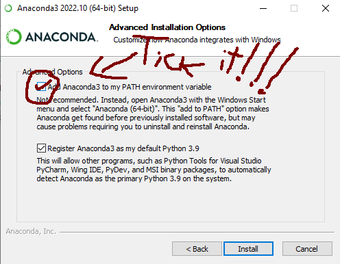

#### (installing a compiler for windows for python) Pre-requisite: install python headers

A first step, regardless of the compiler that you'll be using, you need to install the python headers that will be needed to compile python extensions:
```shell
conda install libpython
```

As per installing the compiler that will be building extensions:

#### (installing a compiler for windows for python) Option 1: Installing MSVC

The easiest way to get this compiler is by installing "Visual Studio Build Tools" from microsoft, which is likely to pop-up easily in a google search. At the time of writing (but note that the link might change in the future, so find "msvc build tools" in a search engine if it doesn't work) it was available under [this link](https://visualstudio.microsoft.com/downloads/) for download, but **be careful about what you click there!!**

The microsoft web page above might present dark patterns that will try to trick you into installing some paid visual studio product. Be sure to **only** download something saying **"build tools"** (note that "visual studio tools" is also a different thing), which is likely to be hidden in the web page under many buttons. Depending on the day that you visit that page, build tools might be under the following menus:
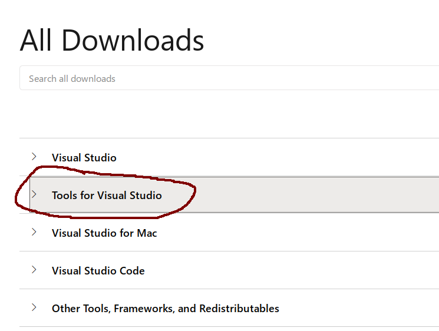


Once you download it, you will need to go through its installer and pick, at a minimum, the following components to install:

* The MSVC C/C++ compiler.
* The command line interface for the compiler.
* Headers (or "SDK" or "development components", as MS names them) for the compiler.
* Runtime libraries for C/C++ (you might need multiple of them).
* The windows SDK and runtime libraries.
* Things that the components above depend on (will get auto-selected by the installer, typically bundling .net frameworks along the way).

For example, the following might be a good choice of things to install, but note that **the specific versions and components will change in the future** and this screenshot will become outdated as time passes - check the paragraphs above for a better idea:
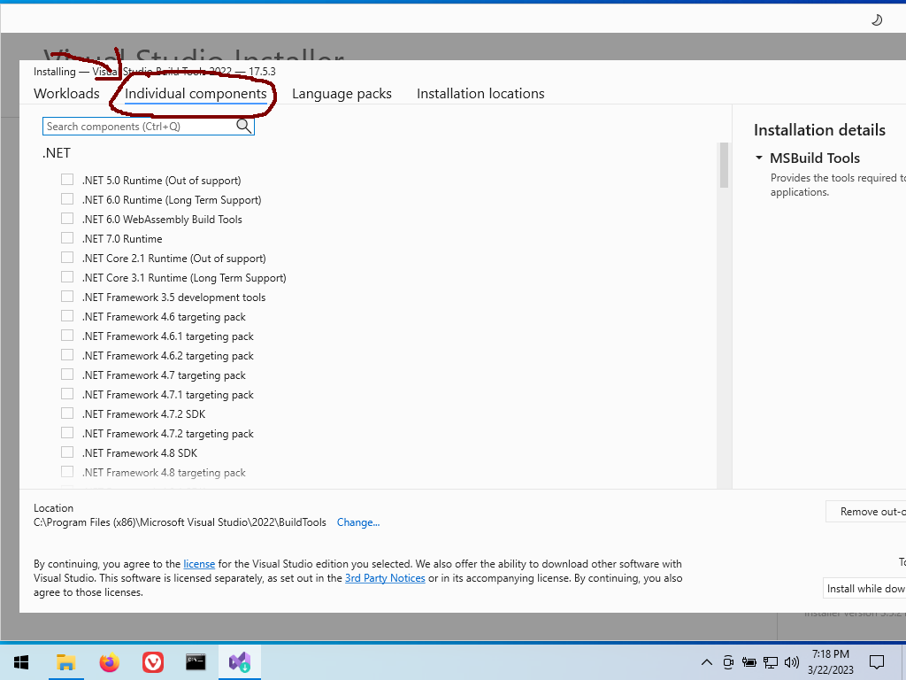
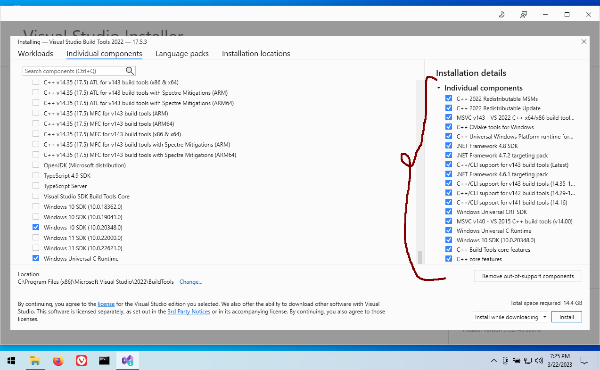

(it doesn't hurt to install more things from there, but they can use quite a lot of disk space. If space is not a problem, consider installing whole packs from the menus in the installer)

Once you install all of this, it should get picked by python's `setuptools` automatically, but if it doesn't, you can force usage of `msvc` for a single package when using a `setup.py` script like this:
```shell
python setup.py install --compiler=msvc
python setup.py build_ext --inplace --force --compiler=msvc
... etc.
```

For a system-wide configuration, if it somehow doesn't get auto-configured, you might want to google about configuring a compiler in `setuptools` and `distutils`.

#### (installing a compiler for windows for python) Option 2: Installing MinGW

_Note: while this guide here says "MinGW", some google searches might reveal that there are multiple projects that call themselves "mingw", and that cython might name the one it can work with as "mingw32" even though it's not what their developers call "mingw32". For simplicity, this guide will not try to distinguish what is what, just point to what might work with a python install._

##### (installing mingw for python) Alternative 1 (might not work): use conda

If you have an old computer or you are otherwise lucky enough, you might be able to install the `msys2` toolchain from conda:
```shell
conda install m2w64-toolchain
```

but be aware that **at the time of writing this toolchain was unmaintained** and, even if it succeeds in installing, **it might crash once you try to use it** with real packages. See below for a more up-to-date alternative:

##### (installing mingw for python) Alternative 2: use the R toolchain

The same compiler toolchain that CRAN uses to build R packages can also be used for Python packages. It comes with everything that you will need in an easy installer so simply [download and install RTools](https://cran.r-project.org/bin/windows/Rtools/) from CRAN.

Note however that RTools doesn't auto-register itself in your system in the same way as MSVC does, so you'll need to do these steps manually:

1. Find out where it installed the compiler executables. These are files like `gcc.exe` and `g++.exe` which will be under some folder called `bin` within the folder where RTools was installed. For example, for RTools4.2, they might be under a folder like this:
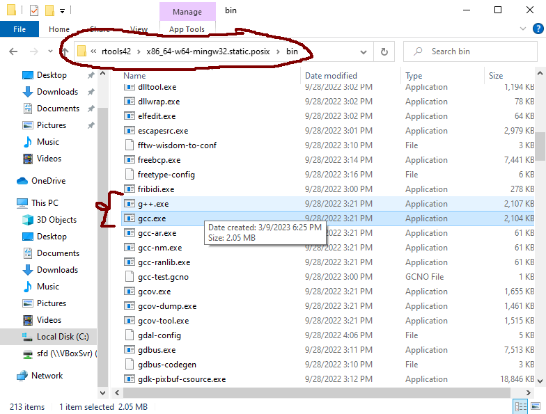
2. Copy the path of the folder to somewhere safe for later.
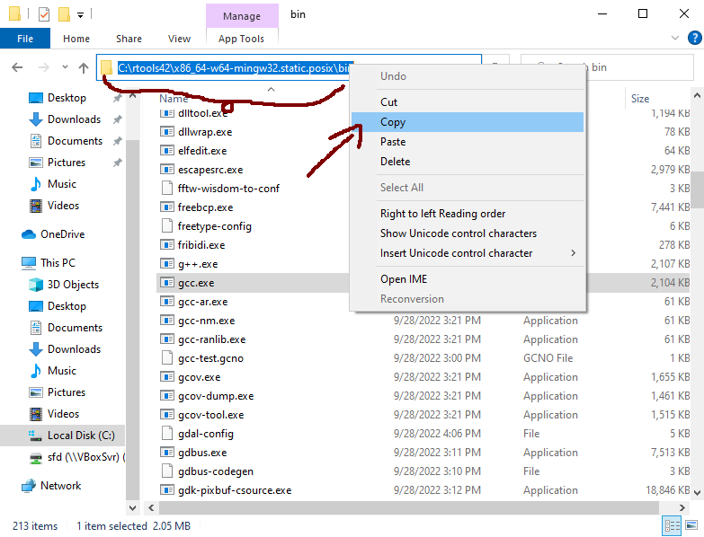
3. Add that path **at the end** of your `PATH` environment variable:
    * Go to the control panel, type "environment variables" there, and pick the menu where to edit them:
    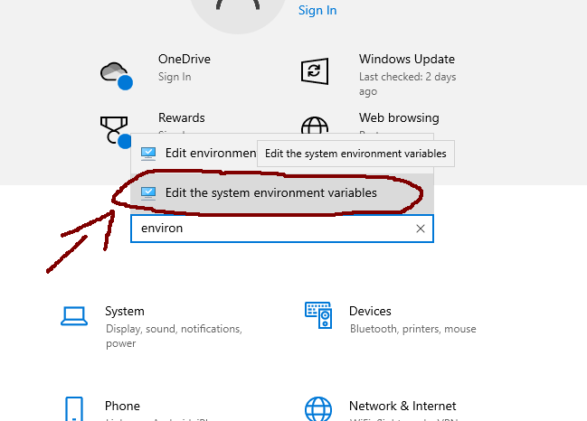
    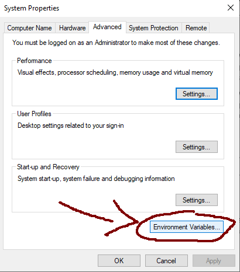
    * Find the users's `PATH` variable and enter into "edit" mode:
    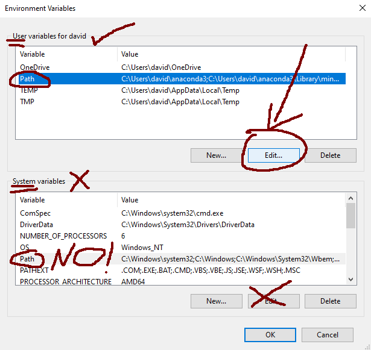
    * Add the path that you copied in the previous step **as the last entry** (MUST be below the ones from anaconda!!!):
    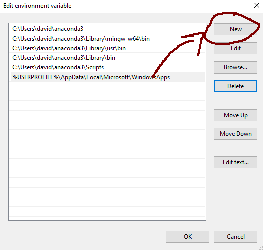
    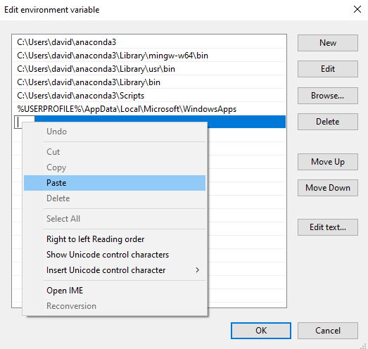
    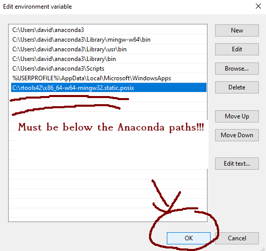
    * Click Ok in all subsequent menus.
4. Restart the computer.

Just like with MSVC, once you install it and set it up like this, it should get picked by python's `setuptools` automatically, but if it doesn't, you can force usage of MinGW for a single package when using a `setup.py` script like this:
```shell
python setup.py install --compiler=mingw32
python setup.py build_ext --inplace --force --compiler=mingw32
... etc.
```

For a system-wide configuration, if it somehow doesn't get auto-configured, you might want to google about configuring a compiler in `setuptools` and `distutils`.

## (installing a compiler) macOS

### (installing a compiler for macOS) 1. Installing apple's stripped-down clang

On apple systems, the most common compiler (and the one most library developers target for this platform) is the apple version of clang which comes with `xcode-select`. It gets installed automatically alongside with other common programming software such as git, python, etc. when you try to execute the command in a terminal. That is, open a terminal and execute something like this:

```shell
clang
```

or
```shell
git
```

etc.

Then it will offer you to install the whole `xcode-select` package if it's not already installed, which includes `clang` among other software.

**Important:** this apple-vendored version of `clang` differs from the stock LLVM `clang` in _bad_ ways: it is a stripped down version which lacks some capabilities such as OpenMP support.

Note also that some standard headers for this stripped-down clang will be different than the LLVM-developed headers that the authentic clang ships. For best performance, consider switching to linux and to GCC.

### (installing a compiler for macOS) 2. Installing GCC

It is likely, especially if using python, that some packages will be unable to compile with apple's clang ([example that will fail to install from source](https://github.com/matrix-profile-foundation/matrixprofile)), so you'll probably want to additionally install GCC, which is available from brew:
```
brew install gcc
```

**BUT** note again that, apple being apple, the command `gcc` in macOS is aliased to its stripped-down `clang`, perhaps in some bad-faith attempt to dissasociate the name "gcc" from GNU's trademark.

Thus, in order to use the _real_ GCC compiler developed by GNU, you'll first need to figure out how to call its executable. If you installed GCC throw `brew`, you will get a post-installation message that will tell you how to call it. If you missed the message, you can find out where it got installed by executing the following command:
```shell
brew --prefix gcc
```

Most likely, the executable will be under a path like this:
```
/usr/local/opt/gcc/bin
```

And it will be named according to the version that was installed. Thus, if installing for example GCC version 12, the executables will be something like this:
```
/usr/local/opt/gcc/bin/gcc-12
/usr/local/opt/gcc/bin/g++-12
/usr/local/opt/gcc/bin/gfortran-12
```

Typically, you will be able to call them by a single command having the major version number appended to it - i.e.
```shell
gcc # -> calls apple clang
gcc-12 # -> calls brew-installed GCC
```

(thisis  again _assuming that it installed version 12_, otherwise the number there will be different)

If you want `gcc` in the terminal to end up calling the real GCC, you will need to:

1. Create symlinks without the version in the names:
```shell
sudo ln -s /usr/local/opt/gcc/bin/gcc-12 /usr/local/opt/gcc/bin/gcc
sudo ln -s /usr/local/opt/gcc/bin/g++-12 /usr/local/opt/gcc/bin/g++
```
(`gfortran` is probably already there, as clang doesn't compile fortran _yet_, but this situation _might_ change in the future)

2. Add the location of those binaries to your `$PATH` environment variable - assuming you are using `zsh` which comes by default on mac:
```shelll
printf 'export PATH=/usr/local/opt/gcc/bin:${PATH}\n' >> ~/.zshrc
```

(if using `bash`, you'll need to add these lines to `~/.bashrc` or `~/.profile` instead)

After that, executing `gcc` in a _new_ terminal (launched after you edited `.zshrc`) should call the _real_ GCC, which you can verify by executing:
```shell
gcc --version
```

And confirming that it's _not_ apple's clang by checking that the message contains a copyright header from **GNU**.

#### 2.1 Compiling R packages with GCC

If you are installing packages from CRAN, it's unlikely that you'll find something that wouldn't compile with apple's stripped-down clang, but if for some reason (e.g. if you want better performance) you still want to use GCC for compiling R packages, you can do so by setting up a file `~/.R/Makevars` like the following, **assuming that you installed gcc-12 from brew** (you _do_ need to hard-code the version number here):
```
CC=gcc-12
CXX=g++-12
CXX11=g++-12
CXX14=g++-12
CXX17=g++-12
CXX20=g++-12
FC=gfortran-12
FF=gfortran-12
```

**Note:** when running on apple systems, OpenMP support in R packages will not be added automatically for packages that use it regardless of the compiler, so check the rest of this guide for more details on how to enable it.


#### 2.2 Compiling Python packages with GCC

Just like for linux, one can modify the compilers used by python's `setuptools` through the same environment variables that are used by the GNU build system. For example, to install a single package with GCC **version 12** (assuming that `brew` installed _that_ specific version, modify the numbers otherwise), the following might do:
```shell
CC=gcc-12 CXX=g++-12 python3 -m pip install <your package(s)>
```

To add them permanently to your user's configuration, these can be added to something like your `.zshrc` file (if using the default `zsh` for mac) or `.bashrc` (if using `bash`) or `.profile` - example:
```shell
printf "export CC=gcc-12\n" >> ~/.zshrc
printf "export CXX=g++-12\n" >> ~/.zshrc
printf "export FC=gfortran-12\n" >> ~/.zshrc
```

**Important:** there might be incompatibilities if you download _some_ pre-compiled wheel packages built with apple-clang and then compile and install _other_ packages with GCC in the same python environment. When such incompatibilities are encountered (will manifest as packages failing to import due to a library load error), it's usually helpful to re-install all of the offending packages with the same toolchain. This mostly concerns packages that have C++ code and depend on other packages with C++ code.

# 1.2 Installing additional python packages for compilation

If you are using python, you will probably need a few additional packages in order to install _other_ packages:
```shell
pip install -U numpy scipy cython numba pythran wheel setuptools
```

**If you are on windows, it's highly recommended that you install them with `conda` instead:**
```shell
conda install numpy scipy cython numba pythran wheel setuptools
```

(Note that, for windows under conda, this will additionally install the clang compiler if it wasn't already installed)

On linux systems, if you **didn't** install python from conda and you are using a **minimalistic system version** of `python`, you _might_ need to install the python headers separately - e.g. something like this might do depending on distribution:

* Debian-based:
```shell
sudo apt-get install libpython3-dev
```

* Redhat-based
```shell
sudo yum install libpython3-devel
```

These are also available from `conda` as follows, if for some reason they didn't already get installed from elsewhere:
```shell
conda install libpython
```

# 2. Enabling compiler optimizations

**Note:** instructions for MSVC on windows are beyond the scope of this guide. Skip this part (or google about it for more details) if you are using MSVC on windows.

Most typically, **compilers produce code that might run slower than it ought to be**. You might wonder why this happens and why things are not designed to run as fast as possible from the get go:

* Different CPUs support different instruction sets or "features". If you compile a given library for a given instruction set and then try to use this compiled library in a different computer that doesn't support the same instruction set, it will throw errors and crash once you try to use it. Thus, library developers typically do not enable support for newer CPU features when they provide pre-built libraries for users, nor do compilers enable support for them by default, but if you are just installing things in the same computer where they'll be run, you'll want them tuned for that specific computer. There are some notable exceptions such as OpenBLAS or NumPy which provide different versions of different functions for each CPU type already and choose the fastest supported version when you run them, but this is rather rare in smaller libraries.
* Mathematical operations with floating point numbers do not follow associativity rules. When dealing with real numbers, one can confidently state that some operations lead to the same result regardless of the order in which they are computed - e.g. `(a + b) + c == a + (b + c)` - but with computer floating point numbers, this will not necessarily be the case. Compilers prefer to respect the order of operations that the user wrote in the code, which oftentimes comes at the expense of foregoing optimizations, and need to be told otherwise that they can optimize or fuse computations within reasonable limits of what they can change or assume.
* Compilers tend to follow the IEEE standard for floating point arithmetic. This standard was designed many decades ago before modern computers and made some fundamental mistakes about how undefined operations or errors should be handled. Namely, the standard specifies a type of _global_ "floating point exceptions", which means that it will monitor every division operation for e.g. a division-by-zero case and will mark their error state according to the last thing that happened in the last thread that executed something leading to an error. In practice, no library developer ever uses these exceptions (note that a division by zero still produces a NaN value which is what people tend to check for, rather than the global floating point exception), but the compiler still needs to handle them - e.g. it cannot do multiple divisions and logarithms at the same time in multiple threads as this exception mechanism means that it needs to know what happened last in sequential order. You'll typically want to disable these to enable more optimizations.
* Some compiler features like "link-time optimization" were deemed as non-production-ready in older compiler versions and _might_ cause very obscure bugs in very rare situations in non-up-to-date compiler versions. This is unlikely to ever affect scientific libraries - for example, CRAN currently compiles all of its packages with this optimization turned on, and doesn't seem to suffer any issues from it. Note that this can significantly increase compilation times however.
* Some linux distributions (e.g. Fedora) by default enable some debugging functionalities in C/C++ code, which are not meant to be used in release versions. These can help debugging issues, but they come at the expense of performance. Most linux distributions (basically everything debian-based or arch-based, plus slackware, gentoo, etc.) have them disabled as is the default from GNUs build system.

To enable the optimizations that you'll typically want, you'll need to pass a few flags to the compiler. Assuming you have either `gcc` or `clang` as compiler, you might want the following:
* `-march=native` (for ARM and PPC systems, replace with `-mcpu=native`). This enables the highest-supported SIMD instructions for the computer where it is being compiled.
* `-O3`. This lets the compiler do some potentially unsafe optimizations within reasonable limits. It is the default for cython-compiled packages and for cmake's release-level compilations, but for R this is set at `-O2`.
* `-flto=auto` (for mingw, replace with `-flto`). This enables link-time optimization that gets parallelized while compiling. `-flto` (without the parallelization during compilation, which leads to the same result but is slower while installing) is the default for R packages, but not for python packages.
* `-fno-math-errno -fno-trapping-math`. These disable the floating point exceptions system.

For _some_ packages, if you are feeling lucky, you might additionally try out `-ffast-math` or even `-Ofast`, but be aware that these can lead to observing **significantly different (and sometimes stochastich) results/outputs** when calling library functions due to the kind of unsafe optimizations that they introduce - for example, `-Ofast` will make the compiler assume that NaN values will never be encountered, thus a function checking for NaN values will be assumed to always return "false" when these optimizations are enabled.

## (compiler optimizations) R packages

To pass flags to the compiler that will be used with R packages, you need to edit the file `~/.R/Makevars` (this is a simple text file - you'll need to create one if it doesn't exist). On windows, replace `~` with your user's folder (what you when executing `path.expand('~')` inside R). To add flags on top of what your global config already adds (which you should _not_ remove), you'll need to use `+=` instead of `=`. Note that, for C++, flags might need to be set on a per-standard basis:

```
CFLAGS += -O3 -march=native -fno-math-errno -fno-trapping-math
FCFLAGS += -O3 -march=native -fno-math-errno -fno-trapping-math
FFLAGS += -O3 -march=native -fno-math-errno -fno-trapping-math
CXXFLAGS += -O3 -march=native -fno-math-errno -fno-trapping-math
CXX11FLAGS += -O3 -march=native -fno-math-errno -fno-trapping-math
CXX14FLAGS += -O3 -march=native -fno-math-errno -fno-trapping-math
CXX17FLAGS += -O3 -march=native -fno-math-errno -fno-trapping-math
CXX20FLAGS += -O3 -march=native -fno-math-errno -fno-trapping-math
```

For Fedora linux and other linux distributions that do not disable debug mode by default (not applicable to debian and derivatives), you _might_ additionally need to set this extra line:
```
CPPFLAGS += -DNDEBUG
```

## (compiler optimizations) Python packages

For python packages, one can again use the same environment variables from the GNU build system (**important:** don't try these options for MSVC on windows).

Assuming a linux or unix-alike system, these might be set by executing commands like the following in a terminal:
```shell
export CFLAGS="-O3 -march=native -fno-math-errno -fno-trapping-math -flto"
export CXXFLAGS="-O3 -march=native -fno-math-errno -fno-trapping-math -flto"
export FFLAGS="-O3 -march=native -fno-math-errno -fno-trapping-math -flto"
export LDFLAGS="-flto=auto"
```

Plus the extra line for Fedora and similar (not needed for debian and derivatives):
```shell
export CPPFLAGS="-DNDEBUG"
```

(**WARNING:** if you are using **gentoo** linux, do not try any of this unless you understand how it'd affect the rest of your system)

To make these environment variables permanent, you'll need to add those lines to some file that would get sourced by shells, such as `~/.profile`, `~/.bashrc` (if using `bash` as shell, which is the default in most desktop linux distributions), `~/.zshrc` (if using `zsh`, which is the default on apple systems), or `/etc/environment` (note that this is a non-user file).

For windows, environment variables need to be set through the control panel. See the screenshots from previous sections of this guide for an example of how to set environment variables on windows.


# 3. Installing a good BLAS/LAPACK backend

Many scientific libraries perform operations on matrices and vectors (e.g. matrix multiplication, Cholesky factorization, eigendecomposition, etc.), which are typically handled at the lowest level by a BLAS ("basic linear algebra subroutines") or LAPACK ("linear algebra package") library. R itself, Python libraries like NumPy or SciPy, and C++ libraries like Eigen or Armadillo, are examples of software that offloads these computations to BLAS/LAPACK, and benefit from having a good implementation backing them.

It might sound like a matrix multiplication should by now be a solved problem that people do not need to worry about when compiling code, but in reality, optimizing these types of operations is not something easily handled by a compiler, and the choice of library that performs the underlying computation can make a large difference (e.g. by making the computation faster by 1-2 orders of magnitude). Thus, one should make sure to use the most suitable library for the platform where code is executed, and make sure that the parallelization backend used by said library plays along with other software that might also introduce parallelizations in its calculations.

In this regard, at the time of writing, the best options available are:

* Intel's MKL. This library is free-of-charge but not open-source. Note that it is only available for `amd64` machines (a.k.a. x86-64). This is typically the fastest library for most operations, and the only major player that is able to optimally perform internal parallelism when running on blocks of code parallelized externally elsewhere. It also offers some additional non-standard BLAS extensions for e.g. sparse linear algebra, and some packages (e.g. PyTorch) are _only_ able to use this library as backend due to the extra non-standard extensions. **IMPORTANT:** this library is made to purposefully run slower on AMD CPUs. It's however possible to monkey-patch it to trick it into thinking that it is running on an intel CPU and get better performance out of it - one can google about it for more information.
* OpenBLAS. This is probably the fastest, most featureful, and most compatible open-source BLAS library out there for multiple CPU architectures. Note however that there are several release versions of this library, with different options for e.g. the parallelization backend, integer size, etc. To get the best performance out of this library, **be sure to install the OpenMP variant instead of the pthreads variant**, which is typically not the default - for example, most linux distributions (and freebsd too) will ship the `pthreads` version by default, which is not as performant. Same for pre-compiled version of e.g. NumPy, which also ship the pthreads version by default.
* Vendor-specific libraries from the hardware manufacturer, such as IBM's (for their PPC systems) or apple's (for macOS).

There are other open-source options out there (e.g. BLIS, ATLAS), but typically they are not as performant, and most importantly, most of them do not handle parallelism dynamically the same way MKL/OpenBLAS do - for example, it is typical in some libraries to set the number of threads of the BLAS/LAPACK library at runtime, or to disable parallelism in BLAS/LAPACK when entering a parallel block of code and then restore it when exiting such block, which implementations like BLIS or ATLAS cannot do.


A couple additional notes about BLAS/LAPACK implementations:

* If using MKL, the library is usually able to discern when it is run in an OpenMP parallel block, even though its default parallelization backend is intel's TBB. However, in some cases, there might be problems (e.g. manifesting as incorrect calculations) when MKL with its TBB backend is used alongside with software that uses OpenMP, so one might want to force MKL to use OpenMP to play along with the rest of the libraries. This can be accomplished by setting environment variable `MKL_THREADING_LAYER=GNU` **before the library is loaded**.
* When some library uses OpenMP as parallelization backend, and the system uses GNU's `libgomp` as the OMP implementation, **the process will hang if any parallelization is attempted inside a forked process**. This concerns for example libraries for HTTP services like `gunicorn` (python) or `RestRserve` (R) which run each request in a forked process, or some parallel backends for e.g. `joblib` (python) or `parallel` (R). As a workaround, one can try to disable all parallelization in the libraries being used, or compile all the offending libraries using LLVM's `clang` + `libomp` (a fork of intel's `libiomp`) instead of `gcc` + `libgomp`. 
* If some library is using TBB instead of OpenMP for parallelization (this is very uncommon in scientific software, but it is done by numba-based libraries such as LensKit), only intel's MKL is able to play along with external parallelization. For other libraries, one might want to manually disable multi-threading if the library is going to be used inside a TBB-parallelized block. This can be achieved with environment variables (typically `OMP_NUM_THREADS=1`) or software like `threadpoolctl` (Python) or `RhpcBLASctl` (R).
* Some libraries - most notably, SparseSuite and its components such as Cholmod (used by e.g. R's `Matrix` package) - benefit from having a BLAS backend that's able to properly handle internal parallelization in combination with external OMP-based parallelization. A backend like OpenBLAS is likely to be very slow in these cases due not being able to adjust its parallelization, so one might want to use MKL regardless of CPU vendor (assuming `amd64` machines) when coupled with such software.
* OpenBLAS is a volunteer-driven project that typically takes its time before it is able to implement computations in the most optimal way for a new CPU generation. Thus, if you are using the latest and shiniest CPU model and it has been less than 1-2 years since its release, you might want to try MKL. Note that AMD also offers its own BLAS backend (a fork of BLIS), but unlike MKL, it's typically not optimized for the newest AMD chips at the moment they are released.
* Unlike MKL and OpenBLAS, BLIS (and its AMD fork with the same name) doesn't couple BLAS and LAPACK into the same library, thus linking to it and to its LAPACK variant ("flame") will take a bit more effort as it will require manually configuring both BLAS and LAPACK in multiple places.

## BLAS/LAPACK for R

R for Windows and macOS, as distributed by the R foundation, ships with its own unoptimized BLAS/LAPACK replacements, while on linux it uses the platform's default BLAS/LAPACK. Fortunately, it's possible to dynamically change its BLAS/LAPACK backend towards any library implementing the standard functions without re-installing anything. 

### (BLAS/LAPACK for R) Windows

On windows, R will install two key DLL files: `Rblas.dll` and `Rlapack.dll`. Replacing them with DLLs from different a library implementing each interface will do the trick (such DLLs can be obtained by downloading pre-built versions e.g. OpenBLAS for windows, or by downloading a pre-compiled NumPy wheel and extracting the DLLs that it ships).

Note however that, if these DLLs are replaced with something with which R wasn't built, it will not be possible to install packages from source that use BLAS/LAPACK with the new DLLs - nevertheless, temporarily restoring the original DLLs and then replacing them later on (after the source package is installed) with the new optimized DLLs suffices for making source-installed packages use the more optimized version.

#### (BLAS/LAPACK for R for windows) Alternative 1: OpenBLAS

Follow [this guide](https://github.com/david-cortes/R-openblas-in-windows).

#### (BLAS/LAPACK for R for windows) Alternative 2: MKL

At some point, there was a Microsoft R distribution ("MRAN") which shipped with MKL preinstalled. This distribution was discontinued later on and thus there aren't any builds for newer R versions, but if one can find older installers from it, regardless of the R version they use, it's possible to install it in a computer, save/copy their DLL files (`Rblas.dll`, `Rlapack.dll`, and anything saying "MKL"), uninstall it, install the R distributed by the R foundation, and copy over those DLL files into the new installation (be aware that the MKL versions might be old and might not run optimally on newer CPUs).

See the link above for information about where to find these DLLs in an R installation.

#### (BLAS/LAPACK for R for windows) Alternative 3: conda (not recommended)

While typically used alongside with Python, it's also possible to install R through `conda` and pick user builds from `conda-forge` shipping a different BLAS library. Instructions for doing so are beyond the scope of this guide.

### (BLAS/LAPACK for R) Linux

On most linux distributions and unix-alike systems like freebsd, R will take the default system's BLAS/LAPACK, which can be changed at any time. For debian-based systems, this is controlled through the debian alternatives system, while for redhat-based systems it might involve creating symlinks in appropriate places.

#### Debian and derivatives

In a fresh debian install, if there is no BLAS/LAPACK already installed, the first such alternative that one installs will become the default. If some package needs BLAS linkage and none is installed, `apt` will first and foremost prefer `openblas-pthreads`, which is not as optimal.

In order to get `openblas-openmp` from the get-to, one can install it like this:

```shell
sudo apt-get install libopenblas-openmp-dev
```

Alternatively, one can also install intel's MKL following the [instructions on their website]():
```shell
wget -O- https://apt.repos.intel.com/intel-gpg-keys/GPG-PUB-KEY-INTEL-SW-PRODUCTS.PUB \
| gpg --dearmor | sudo tee /usr/share/keyrings/oneapi-archive-keyring.gpg > /dev/null
echo "deb [signed-by=/usr/share/keyrings/oneapi-archive-keyring.gpg] https://apt.repos.intel.com/oneapi all main" | sudo tee /etc/apt/sources.list.d/oneAPI.list
sudo apt update
sudo apt install intel-oneapi-mkl
```

(You might also want to install package `intel-oneapi-mkl-devel`).


After installing MKL (or if you accidentally already installed `openblas-pthreads` and want `openblas-openmp`), you might want to configure it to be your system's default BLAS and default LAPACK, which can be achieved either from a GUI like `kalternatives` ir from the CLI - **make sure to select your desired library (e.g. MKL)** in each of these prompts:
```shell
sudo update-alternatives --config libblas.so-x86_64-linux-gnu
sudo update-alternatives --config libblas.so.3-x86_64-linux-gnu
sudo update-alternatives --config liblapack.so-x86_64-linux-gnu
sudo update-alternatives --config liblapack.so.3-x86_64-linux-gnu
```

Additionally, you will need to add the folder where the library stores its files (make sure that the path written here matches with what was shown in `update-alternatives`) to your linker's config:
```shell
sudo touch /etc/ld.so.conf.d/mkl.conf
printf "/opt/intel/oneapi/mkl/latest/lib/intel64\n" | sudo tee -a /etc/ld.so.conf.d/mkl.conf
printf "/opt/intel/oneapi/mkl/latest/lib/intel64\n" | sudo tee -a /etc/ld.so.conf.d/mkl.conf
sudo ldconfig
```

And for RStudio Server in specific, you'll need to set variable `MKL_THREADING_LAYER` to play along with OpenMP **in a system-wide sourceable file** (`~/.profile` won't do for RStudio Server, but is enough for desktop RStudio):
```shell
printf "MKL_THREADING_LAYER=GNU\n" | sudo tee -a /etc/environment
```

#### Redhat-based systems

On redhat-based systems, the handling of this type of software is rather different than on Debian. Installing `libopenblas` on redhat systems will typically install something that bundles all of its variants together (e.g. pthread, openmp, i32, i64, etc.), but which has the pthreads/i32 version as its default just like debian does.

Configuring OpenBLAS-OpenMP or MKL on redhat systems is beyond the scope of this guide, but some google searches about it might help.

**IMPORTANT:** redhat systems typically have very outdated software. If installing OpenBLAS from a redhat repository, chances are that the version it ships will be so old that it will not have support for the CPU in which its executed (assuming a reasonably new machine). One might want to install these software from other sources, but note that redhat's R distribution will not play along with a cmake-installed OpenBLAS. Consider switching to Debian for less hassle.

### (BLAS/LAPACK for R) macOS

By default, macOS ships with something called the "apple accelerate framework", which includes a BLAS library ("veclib"). On ARM systems manufactured by apple, this is the only library that will present reasonable performance, due to being able to use undisclosed functionalities of such CPUs which apple [doesn't share with the open source community](https://github.com/xianyi/OpenBLAS/issues/3789) and thus prevents open-source developers from producing good libraries for their systems.

In order to make R use apple's libraries, one can follow the [instructions from CRAN's FAQ](https://mac.r-project.org/man/RMacOSX-FAQ.html) - at the time of writing, might amount to something like the following command:
```shell
sudo ln -sf /Library/Frameworks/R.framework/Resources/lib/libRblas.vecLib.dylib /Library/Frameworks/R.framework/Resources/lib/libRblas.dylib
```

**IMPORTANT:** there have been multiple reported cases of the apple linear algebra libraries producing incorrect calculations in different software ([example](https://github.com/scipy/scipy/issues/7500)) and no response from apple to such errors, which is why software like R doesn't use it by default in the first place. Use apple software at your own risk and do not base research conclusions on results produced by them.

Alternatively, one might symlink the same `.dylib` file referenced above to a shared object from OpenBLAS, which can be installed from e.g. `brew` - see [this link](https://gist.github.com/nicebread/6920c8287d7bffb03007) for an example.

**IMPORTANT:** apple's `veclib` doesn't play along with external OpenMP parallelism the same way MKL and OpenBLAS do.

## BLAS/LAPACK for Python

Compared to R, handling of BLAS/LAPACK in Python is not standardized - different libraries might ship their own version of BLAS/LAPACK, or might link to the BLAS/LAPACK from either the system OS, or from e.g. `conda`, or (most commonly) from SciPy. Note that the import order of libraries can make a difference in terms of which BLAS ends up used where, regardless of how things were compiled, and different installed libraries can cause incompatibilities in other libraries when loaded simultaneously.

As far as _smaller_ libraries are concerned, most typically, compiled code is interfaced through or produced directly with Cython, and when that is the case, BLAS/LAPACK are typically taken from SciPy's Cython modules, which introduces some degree of standardization and the ability to change the backend after installing libraries. This BLAS/LAPACK is in turn taken from NumPy by default.

NumPy itself can be built with different BLAS/LAPACK backends when compiled from source. When installed through a pre-built wheel, it will bundle its own such libraries, but **note that different builds ship different BLASes**:

* NumPy wheels downloaded from PyPI ship with `openblas-pthreads`.
* NumPy installed from `conda` ships with MKL by default, but can be easily made to switch to `openblas-pthreads`.
* NumPy with `openblas-openmp` is available through `conda-forge`.
* NumPy from the Debian main repository is likely to use the system's BLAS.

Unlike R, changing the BLAS/LAPACK of a NumPy installation typically requires installing a new NumPy version configured to use the desired library. Instructions for doing so from a source installation can be found on the NumPy website and are outside the scope of this guide.

### Switching between MKL and OpenBLAS-pthreads in conda

In the `amd64` Anaconda distribution for Linux and macOS, it's possible to switch the underlying BLAS/LAPACK used in a given conda environment from the default MKL towards OpenBLAS-pthreads by first uninstalling packages like numpy/scipy/mkl, then installing the (**conda**) `nomkl` package, and then reinstalling again those packages (which in the presence of `nomkl` will now pull different versions that link against openblas).

This is typically not advantageous when using intel processors, but can make a positive difference for AMD processors.

In order to create a new conda environment backed by OpenBLAS, one can do something like the following:
```shell
conda create -n env_openblas nomkl numpy scipy
```

# 3.1 Enabling and disabling parallelism for BLAS/LAPACK

Depending on your setup, you might need to explicitly configure your BLAS/LAPACK library to parallelize computations when possible.

One way of achieving this is by setting environment variables **which need to be defined before any library is loaded**. For MKL and OpenBLAS, assuming a linux system, the following will do:
```shell
export OMP_NUM_THREADS=$(nproc)
export OPENBLAS_NUM_THREADS=$(nproc)
export MKL_NUM_THREADS=$(nproc)
```

(for apple systems, you'll need to either replace `$(nproc)` above with the number of threads supported by your CPU, or install the **GNU** coreutils from `brew` which provide the `nproc` command that's not implemented by the apple coreutils)

_(Note: for apple's veclib, the environment variable should be named `VECLIB_MAXIMUM_THREADS`, but it's already set to the maximum by default, so there's not need to configure it)_

In order to make such configuration permanent, you'll need to again add them to a file like `~/.profile`, `/etc/environment`, `~/.bashrc`, `~/.zshrc`, etc.

For windows, environment variables can be set in the control panel (ignore the "export" part in the snippet above) - screenshots can be found in earlier sections of this guide.

Alternatively, the number of threads for these libraries can also be controlled inside an R/Python process:

* In R (requires library `RhpcBLASctl`):
```r
RhpcBLASctl::blas_set_num_threads(
    RhpcBLASctl::get_num_procs()
)
```

* In Python (requires libraries `threadpoolctl` and `joblib`):
```python
import threadpoolctl, joblib

threadpoolctl.threadpool_limits(
    joblib.cpu_count(),
    user_api="blas"
)
```

# 4. (macOS) Install and enable OpenMP

(**Note:** this is already configured automatically in other OSes. Skip this section if you don't use macOS)

Most compilers for unix-alike systems out there offer support for the OpenMP standard for multi-threading (parallelization), with nowadays all major compilers (gcc, clang, icc, xlc, oracle's, among others) converging on enabling it through an argument `-fopenmp`, which many library developers assume will always be accepted.

But apple being apple, the compiler that it ships under the name of `clang` differs from the real LLVM clang and doesn't have support for OpenMP, which means that some packages might either fail to compile, or will not apply any parallelism in their computations (meaning: things will run _much_ slower than on other platforms).

Nevertheless, despite apple's crippling of their own compiler, it's still possible to somehow access the same OpenMP capabilities as the LLVM version through a loophole: at the time of writing, it was possible to pass arguments like `-Xclang` or `-Xpreprocessor` (depending on the compiler version) which would make the compiler enable OMP, provided that one has the library `libomp` installed from elsewhere.

**IMPORTANT:** the mechanism described here is a workaround. The exact way of achieving this (e.g. compiler arguments) has varied over time, the paths where libraries get installed by software such as `brew` have also varied over time, and might present slight variations depending on OS version and CPU architecture. If you want a reliable way of enabling OpenMP and/or getting better performance out of scientific software, consider switching to linux.

As a first step, you'll need to install LLVM's `libomp`:
```shell
brew install libomp
```

## (macOS + OMP) Enabling OMP for R packages

**Note:** There is a [CRAN guide](https://mac.r-project.org/openmp) for how to do this, and CRAN offers its own versions of compilers, headers, and OMP library for R. Nevertheless, you _might_ still want to use the software provided by `brew` if e.g. you have an ARM CPU, or you want more up-to-date versions, or automated updates, among other reasons. if you decide to follow CRAN's instructions, then skip this part.

Alternatively, if this guide becomes outdated at some point, there's a more comprehensive [guide provided by data.table](https://github.com/Rdatatable/data.table/wiki/Installation) that's more likely to be up-to-date.

### (macOS + OMP + R) Alternative 1: using apple's clang

Depending on how `brew` installed `libomp`, you _might_ or _might not_ need to figure out where it installed the library:
```shell
brew --prefix libomp
```

Most likely, it _might_ be placed under some path like `/usr/local/opt/libomp`. Make a note of what this path was.

Now, you'll need to add additional arguments to your `~/.R/Makevars` file (this is a simple text file - create it if it doesn't already exist). Assuming that the path returned by `brew` was as mentioned above (**important:** don't try using `$()` or backticks for substitutions with `brew` here, they will not work), some lines like these might do:
```
CPPFLAGS += -Xclang -fopenmp -I/usr/local/opt/libomp/include
LDFLAGS += -lomp -L/usr/local/opt/libomp/lib
```

If that _still_ doesn't do, you _might_ **additionally** need these:
```
CFLAGS += -Xclang -fopenmp
FCFLAGS += -Xclang -fopenmp
FFLAGS += -Xclang -fopenmp
CXXFLAGS += -Xclang -fopenmp
CXX11FLAGS += -Xclang -fopenmp
CXX14FLAGS += -Xclang -fopenmp
CXX17FLAGS += -Xclang -fopenmp
CXX20FLAGS += -Xclang -fopenmp
```

### (macOS + OMP + R) Alternative 2: using GNU's GCC

As a different alternative, one might switch the compiler entirely to GCC - see the beginning of this guide for more details about setting up the compiler. Note that, if you decide to use GCC as compiler, it's highly recommended that you install every single package from source to avoid incompatibilities, as CRAN builds its binary packages with apple's clang.

Assuming `brew` installed GCC version 12 (you'll need to substitute the numbers here otherwise), some lines like these in your `~/.R/Makevars` might do:
```
CC=gcc-12
CXX=g++-12
CXX11=g++-12
CXX14=g++-12
CXX17=g++-12
CXX20=g++-12
FC=gfortran-12
FF=gfortran-12

LDFLAGS += -fopenmp

CFLAGS += -fopenmp
FCFLAGS += -fopenmp
FFLAGS += -fopenmp
CXXFLAGS += -fopenmp
CXX11FLAGS += -fopenmp
CXX14FLAGS += -fopenmp
CXX17FLAGS += -fopenmp
CXX20FLAGS += -fopenmp
```

**IMPORTANT:** this configuration only applies to new packages that are **compiled from source** after these modifications to your `~/.R/Makevars` file. Packages that are already installed **will not start automatically using OpenMP** after these changes, and _binary_ packages installed from CRAN will most certainly not be able to use OpenMP.

## (macOS + OMP) Enabling OMP for Python packages

In the case of Python packages, the build system is not as standardized or as comprehensive as in R, and the main package repository (PyPI) doesn't have requirements on how OMP linkage should be specified the same way CRAN does for R packages.

This means that it's not possible to come up with a reliable way of enabling OpenMP for all packages out there that support it. Nevertheless, the following might help:

### (macOS + OMP + Python) Case 1: packages that forego OMP support in macOS

Due to the big hassle that is enabling automated support for OpenMP in a build script for macOS and the high degree of instability of the mechanisms to achieve this, many packages have opted for simply disabling OpenMP when a user tries to compile said package from source on an apple device. Example such packages include `scikit-learn` or `glum`.

In these cases, assuming that the underlying C/C++/Fortran code doesn't do any additional workarounds for macOS, support for OpenMP can typically be added back by simply providing the right compiler arguments, which can be passed through environment variables.

Example:
```shell
CC="clang -Xclang -fopenmp" \
CXX="clang++ -Xclang -fopenmp" \
CPPFLAGS="-I$(brew --prefix libomp)/include ${CPPFLAGS}" \
LDFLAGS="-lomp -L$(brew --prefix libomp)/lib ${LDFLAGS}" \
python3 -m pip install --no-binary=glum glum
```

### (macOS + OMP + Python) Case 2: packages that assume `-fopenmp` is available

As the python build system doesn't have a common "add OMP" macro the same way R does, some developers might assume that argument `-fopenmp` will always work (which it does in every other OS). If some package has a `setup.py` script with hard-coded `-fopenmp` argument (example: `matrixprofile`), the trick above won't do, but in this case, it's possible to switch the compiler to GNU's GCC which does take the argument. See the beginning of this guide for more details about setting up a compiler on macOS.

Assuming you installed GCC with `brew` and it installed version 12 (you'll need to substitute the numbers otherwise), something like this might do:
```shell
CC="gcc-12" CXX="g++-12" python3 -m pip install --no-binary=matrixprofile matrixprofile
```

### (macOS + OMP + Python) Other cases

In other cases (e.g. `pybind11` using the cmake system), you might need to tinker with the build scripts of packages individually. For _some_ packages it might help to have the latest versions of `cmake`, `make`, and `autoconf` installed. Otherwise, you might be out of luck depending on how a given package or its build system were designed. Consider switching to linux.

# 5. Setting up the number of OMP threads

Depending on your configuration, OpenMP might default to not performing any parallelization at all. In order to configure the default number of threads that OpenMP will use to parallelize computations (where it is being used), one can set up an environment variable `OMP_NUM_THREADS` - e.g.

```shell
export OMP_NUM_THREADS=$(nproc)
```

(for apple systems, replace `nproc` with the maximum number of threads supported by your CPU, or install the **GNU** coreutils package from `brew` which provides the `nproc` that apple coreutils lack)

In order to make that configuration permanent, add that environment variable to some file like `~/.profile`, `/etc/environment`, `~/.bashrc` (if using `bash` as default shell, which is typically the case in linux), `~/.zshrc` (if using `zsh` as default shell, which is the default in apple systems), etc.

On windows, environment variables can be set up through the control panel (see other sections of this guide for some screenshots). Note that you'll first need to figure out how many threads are supported by your CPU as `nproc` won't work on windows.

Optionally, the number of OMP threads can also be changed dynamically inside R or Python:

* R:
```r
RhpcBLASctl::omp_set_num_threads(
    RhpcBLASctl::get_num_procs()
)
```

* Python:
```python
import threadpoolctl, joblib

threadpoolctl.threadpool_limits(
    joblib.cpu_count(),
    user_api="openmp"
)
```

# 6. Try out a different malloc and libm

(these points are not applicable to windows)

## 6.1 Memory allocator

If the library you are using does many repeated memory allocations, one might benefit from using a more optimized memory allocator than the system's default. For linux and unix-alike systems, one might want to try out `jemalloc` or `tcmalloc`. Note that `jemalloc` is the default memory allocator in freebsd and in Rust libraries.

While some libraries ship with their own memory allocator like `jemalloc` bundled into the pre-compiled binaries (examples that do this: `duckdb`, `clickhouse`, `catboost` (with tcmalloc), among others), the vast majority of libraries simply use whatever is provided by the system's `libc` (most typically this is GNU's `glibc` in linux systems), or in the case of R and Python libraries, the respective equivalents that share the allocator with the underlying R/Python process.

On linux systems, one can typically install a library like `jemalloc` from the package manager:
```shell
sudo apt-get install libjemalloc-dev
```

or
```shell
sudo yum install libjemalloc-devel
```

or, for apple systems:
```shell
brew install jemalloc
```

(**IMPORTANT:** jemalloc does not work universally across all setups. Do not try on apple-ARM or other systems with non-default kernel page sizes)

Then, one can force `jemalloc` as the default memory allocator for a given process, even if the underlying library is default-linked against GNU's `glibc`, through `LD_PRELOAD`.

For example, assuming this is linux and you installed `jemalloc` with major version 2 (you'll need to modify these names otherwise), start your R/Python processes like this:

```shell
LD_PRELOAD=libjemalloc.so.2 R
```

or
```shell
LD_PRELOAD=libjemalloc.so.2 PYTHONMALLOC=malloc python
```

And they will use `jemalloc` by default.

## 6.2 Math library

Depending on what exactly a given library is doing, if using an `amd64` CPU, one _might_ be able to get better performance out of a more optimized `libm` than the default from GNU's `glibc`. One such example of a more optimized library is AMD's `libm`, and some example of functions that are taken from this library are trigonometric functions from the C/C++ `math.h/cmath` headers.

Likewise, for IBM systems, one might want to try their mathematical libraries optimized for PPC instead of GNU's.

Instructions for installing and using these libraries are beyond the scope of this guide, but one can check AMDs website:
https://www.amd.com/en/developer/aocl/libm.html

# 7. Installing packages from source

## R

On Windows and macOS, R's `install.packages` will by default pull binary packages from CRAN which are already pre-compiled for the specific platform where R is running. These packages built by CRAN will not be able to use all the optimizations that were set up in this guide, so you'll need to compile the packages from source in order to benefit from e.g. the compiler optimizations that are set up in your `Makevars` file.

In order to install a package from source, one can pass argument `type="source"` to `install.packages`. For example, in order to install a more optimized `data.table` (assuming you set up a `Makevars` file with additional arguments as indicated in this guide, otherwise there won't be any difference), one can issue the following:
```r
install.packages("data.table", type="source")
```

For linux and other OSes, packages from CRAN always install from source so the extra `type` argument is not needed.

## Python

On python, the build system for packages is not as standardized or as thoroughly designed as in R. Unlike CRAN (R's package repository) which automatically builds binary packages ouf of source code submitted by library authors, PyPI allows uploading both binary and source distributions with arbitrary build scripts, with no requirement for them to match with each other or to have both types of versions available for a given package. Some packages such as `catboost` might not even provide source versions on PyPI, while others might not provide binary versions, or might provide binary versions which are somehow incompatible with your platform, yet `pip` will happily let you install them without warning. Installing source packages from PyPI will not always work (especially if they _don't_ use the `setuptools` system), but one can nevertheless try.

In order to install a single package from source distribution if available, one can try the following:
```shell
pip install --no-binary=<package name> <package name>
```

In order to install both the package(s) and its dependencies from source, one can pass `--no-binary=:all:` along with `--no-cache-dir` - example:
```shell
pip install --no-cache-dir --no-binary=:all: <package name>
```

And to recall, in order to enable optimizations (and this is assuming the package uses `setuptools` or `distutils` for its build system), if you haven't already defined appropriate environment variables, they can be defined for the command being executed on-the-fly - for example, to install `duckdb` with all optimizations enabled:
```shell
CFLAGS="-O3 -march=native -flto -fno-math-errno -fno-trapping-math" \
CXXFLAGS="-O3 -march=native -flto -fno-math-errno -fno-trapping-math" \
LDFLAGS="-flto=auto" \
pip install --no-cache-dir --no-binary=:all: duckdb
```

(command above assumes linux with GCC or clang running on an `amd64` CPU, for appropriate arguments in other platforms and configurations, see the rest of this guide)

**Reminder for `conda` users:** some packages (particularly those written in C++) might fail to import if compiled with a different compiler and/or C++ runtime library than what your `conda` uses for its subsystem (especially if the package uses a different build system that might pull other system libraries). If your package fails to import after installing (likely to happen with something like `xgboost` which uses a different build system), you might need to either pick the right compiler, or preload the right library - e.g. for a debian12 system:
```shell
LD_PRELOAD=/usr/lib/x86_64-linux-gnu/libstdc++.so.6 python
```

Note also that many packages have system dependencies that might need to be installed externally, so when installing from source, be sure to check that what you are installing succeeds and is importable afterwards.
